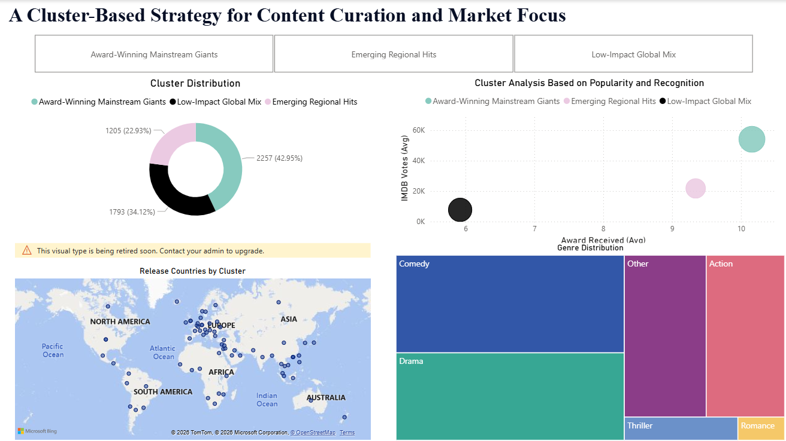
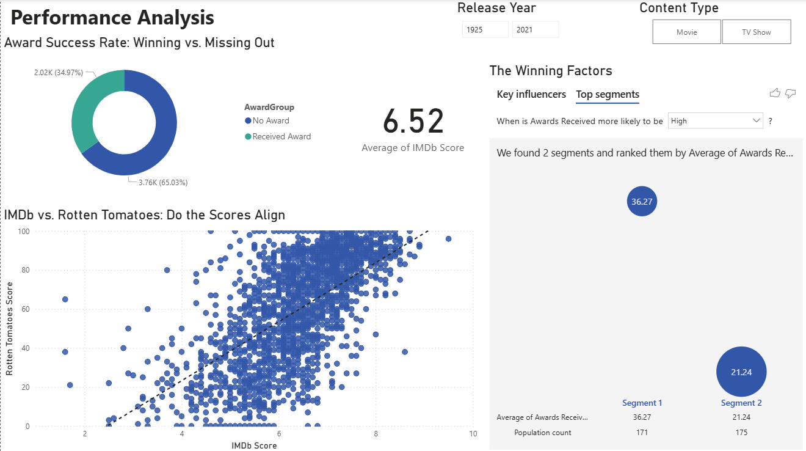

# Netflix Content Performance Analytics  
### Business Intelligence & Market Segmentation (Power BI + R)

End-to-end analytics project evaluating Netflix’s global content performance using interactive dashboards and unsupervised machine learning to support strategic content investment decisions.

---

## Executive Summary

This project analyses how content type, audience ratings, awards, and geography influence performance across Netflix’s global catalogue.

Using Power BI for executive-level dashboards and R for K-means clustering, the analysis identifies structural performance patterns and segments markets into strategically distinct content groups.

The output is a decision-support framework for:

- Content acquisition prioritisation  
- Award-targeted production strategy  
- Regional investment focus  
- Portfolio optimisation  

---

## Business Context

Streaming platforms operate in high-cost, high-competition environments where content investment must be backed by measurable performance indicators.

Key questions addressed:

- Which content types dominate catalogue distribution?
- Do IMDb and Rotten Tomatoes scores align consistently?
- Is award recognition associated with stronger commercial outcomes?
- Are certain markets structurally similar in content performance?
- Can clustering reveal strategic content positioning opportunities?

---

## Technical Approach

### 1. Business Intelligence Layer (Power BI)

- Designed a structured data model integrating Netflix, IMDb, Rotten Tomatoes, Metacritic, and awards datasets  
- Built calculated measures and KPIs to evaluate:
  - Content distribution and genre concentration  
  - Audience reception alignment (IMDb vs Rotten Tomatoes)  
  - Award success rates  
  - Commercial performance drivers  
  - Director-level output and revenue  

- Implemented interactive filters and slicers to support executive exploration  
- Applied dashboard storytelling principles to guide interpretation  

---

### 2. Market Segmentation Layer (R – K-Means Clustering)

- Engineered country-level features combining:
  - Average popularity (IMDb votes)  
  - Award recognition  
  - Genre mix  
  - Content volume  

- Normalised features prior to clustering  
- Applied K-means clustering  
- Evaluated cluster structure and interpretability  

Identified three strategic segments:

1. **Award-Winning Mainstream Giants**  
2. **Emerging Regional Hits**  
3. **Low-Impact Global Mix**  

Each cluster reflects distinct content positioning and investment profiles.

---

## Key Insights

- Award-recognised titles demonstrate materially stronger performance indicators  
- IMDb and Rotten Tomatoes scores show positive alignment, though variability exists across genres  
- A small group of markets disproportionately contributes to high-performing content  
- Distinct structural clusters indicate that a single global content strategy is suboptimal  

The analysis suggests segmentation-driven content planning improves strategic alignment.

---

## Dashboard Highlights

### Cluster-Based Strategy Framework

This dashboard view illustrates:

- Cluster distribution by market  
- Popularity vs recognition positioning  
- Geographic release concentration  
- Genre concentration differences across clusters  

---

### Performance & Recognition Analysis

This view highlights:

- Award success rate distribution  
- IMDb vs Rotten Tomatoes alignment  
- Recognition influencers  
- Segment-level performance comparison  

---

## Business Decisions Supported

- Targeted content acquisition  
- Award-driven production strategy  
- Regional market prioritisation  
- Genre-level capital allocation  
- Risk reduction in low-performing segments  

---

## Repository Contents

- `netflix_bi_dashboard.pbix` – Full interactive Power BI dashboard  
- `clustering_analysis.R` – R script for clustering analysis  
- `cluster_strategy_overview.png` – Strategic segmentation snapshot  
- `performance_analysis_overview.png` – Performance analytics snapshot  

---

## Skills Demonstrated

- Business Intelligence & dashboard storytelling  
- Data modelling and KPI design (Power BI)  
- Cross-dataset integration  
- Feature engineering  
- Unsupervised machine learning (K-means clustering)  
- Strategic interpretation of analytical outputs  
- Translating data into actionable business decisions  

---

## Positioning

This project demonstrates the ability to move beyond descriptive reporting and apply structured analytics to support strategic media and platform decisions.

The focus is on clarity, commercial relevance, and analytical rigour.

